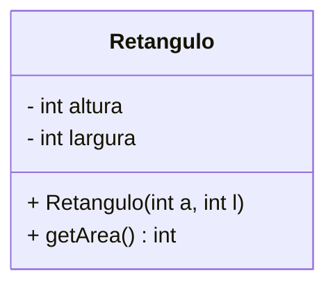
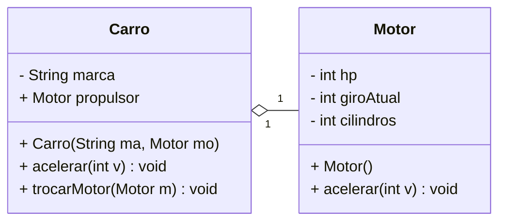
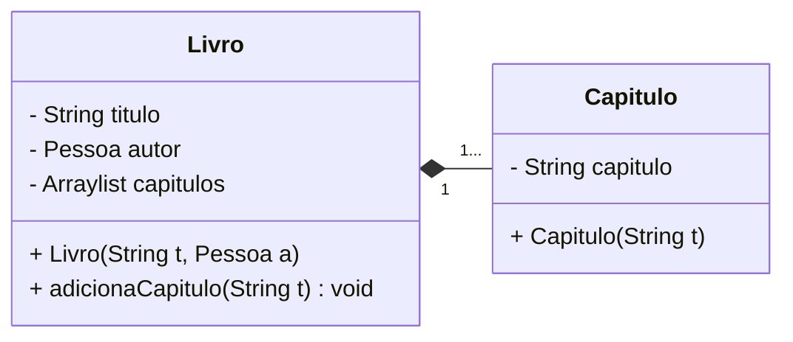

# Diagrama de classes UML

obs: documentação mermaid: https://mermaid.ai/open-source/syntax/classDiagram.html

## Bloco do retângulo

```mermaid
classDiagram
    
    class Retangulo{
        - int altura
        - int largura
        + Retangulo(int a, int l)
        + getArea() int
    }
```
## Bloco do Carro

```mermaid
classDiagram
    
    direction LR
    
    Carro "1" o-- "1" Motor
    
    class Carro{
        - String marca
        + Motor propulsor
        + Carro(String ma, Motor mo)
        + acelerar(int v) void
        + trocarMotor(Motor m) void
    }
    
    class Motor {
        - int hp
        - int giroAtual
        - int cilindros
        + Motor()
        + acelerar(int v) void
    }
```
## Bloco do Livro

```mermaid
classDiagram
    
    direction LR
    
    Livro "1" *-- "1..." Capitulo
    
    class Livro{
        - String titulo
        - Pessoa autor
        - Arraylist<Capitulo> capitulos
        + Livro(String t, Pessoa a)
        + adicionaCapitulo(String t) void
    }
    
    class Capitulo{
        - String capitulo
        + Capitulo(String t)
    }
```