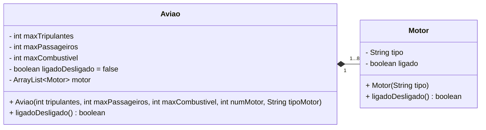

# Diagrama de classes UML

## Diagrama da classe Avião

```mermaid

classDiagram
    
    direction LR
    
    Aviao "1" *-- "1...8" Motor
    
    class Aviao {
        - int maxTripulantes
        - int maxPassageiros
        - int maxCombustivel
        - boolean ligadoDesligado = false
        - ArrayList~Motor~ motor
        + Aviao (int tripulantes, int maxPassageiros, int maxCombustivel, int numMotor, String tipoMotor)
        + ligadoDesligado() boolean
    }
    
    class Motor {
        - String tipo
        - boolean ligado
        + Motor (String tipo)
        + ligadoDesligado() boolean
    }

```