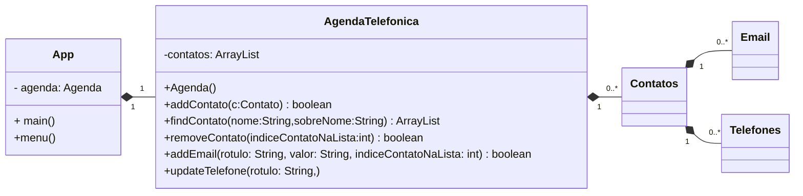

# Diagrama de classes UML

## Diagrama da classe AgendaTelefonica

```mermaid

classDiagram
    
    direction LR
    
    App "1" *-- "1" AgendaTelefonica
    AgendaTelefonica "1" *-- "0..*" Contatos
    Contatos "1" *-- "0..*" Email
    Contatos "1" *-- "0..*" Telefones
    
    class App {
        - agenda: Agenda
        + main()
        +menu()
    }
    
    class AgendaTelefonica {
        -contatos: ArrayList<Contato>
        +Agenda()
        +addContato(c:Contato) boolean
        +findContato(nome:String,sobreNome:String) ArrayList<Contato>
        +removeContato(indiceContatoNaLista:int) boolean
        +addEmail(rotulo: String, valor: String, indiceContatoNaLista: int) boolean
        +updateTelefone(rotulo: String, )
    }
    
    class Contatos {

    }
    
    class Email {
        
    }
    
    class Telefones {
        
    }
    
```