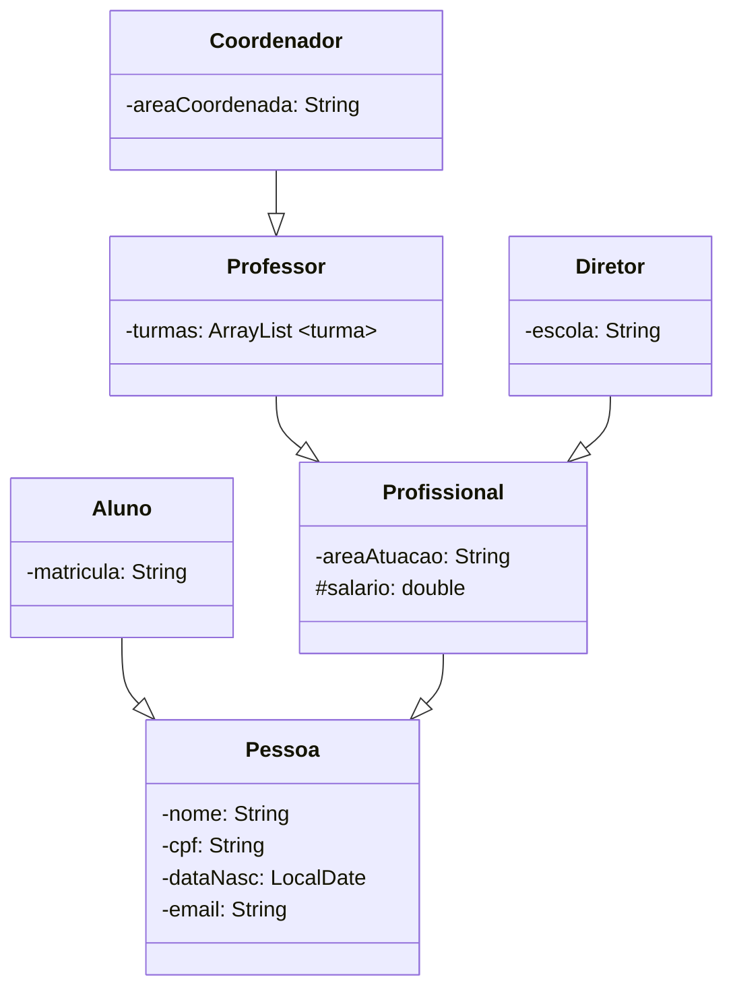
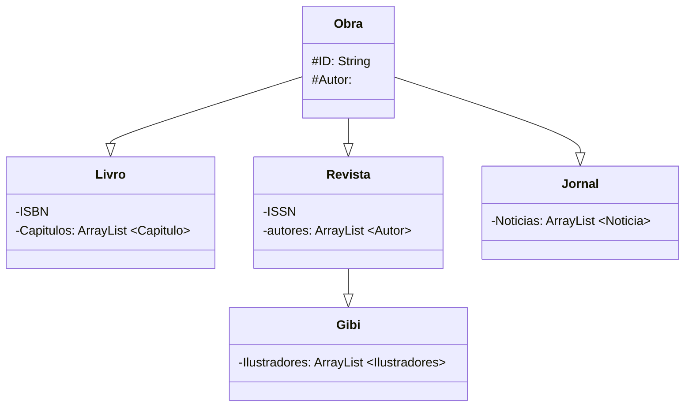

# Exercicios sobre herança

## Diagramas UML
--|>
### Diagrama de uma escola

```mermaid
classDiagram
    
    Aluno --|> Pessoa
    Profissional --|> Pessoa
    Professor --|> Profissional
    Diretor --|> Profissional
    Coordenador --|> Professor
    
    class Pessoa{
        -nome: String
        -cpf: String
        -dataNasc: LocalDate
        -email: String
    }
    
    class Profissional{
        -areaAtuacao: String
        #salario: double
    }
    
    class Aluno {
        -matricula: String
    }
    
    class Professor{
        -turmas: ArrayList ~turma~
    }
    
    class Coordenador{
        -areaCoordenada: String
    }
    
    class Diretor{
        -escola: String
    }
```

### Diagrama de uma biblioteca

```mermaid
classDiagram
    Obra --|> Livro
    Obra --|> Revista
    Obra --|> Jornal
    Revista --|> Gibi
    
    class Obra{
        #ID: String
        #Autor:
    }
    
    class Livro{
        -ISBN
        -Capitulos: ArrayList ~Capitulo~
    }
    
    class Revista{
        -ISSN
        -autores: ArrayList ~Autor~
    }
    
    class Jornal{
        -Noticias: ArrayList ~Noticia~
    }
    
    class Gibi{
        -Ilustradores: ArrayList ~Ilustradores~
    }
```
