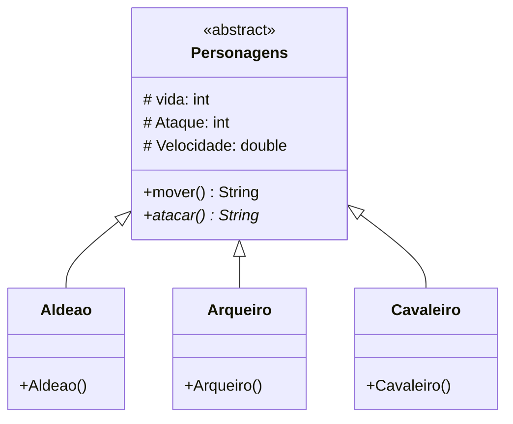

# UML da classe Jogo Java of Empires

```mermaid
classDiagram
    
    Personagens <|-- Aldeao
    Personagens <|-- Arqueiro
    Personagens <|-- Cavaleiro
    
    class Personagens {
        <<abstract>>
        
        # vida: int
        # Ataque: int
        # Velocidade: double
        +mover() String
        +atacar() String*
    }
    
    class Aldeao {
        +Aldeao ()
    }
    
    class Arqueiro {
        +Arqueiro ()
    }
    
    class Cavaleiro {
        +Cavaleiro ()
    }
    
```