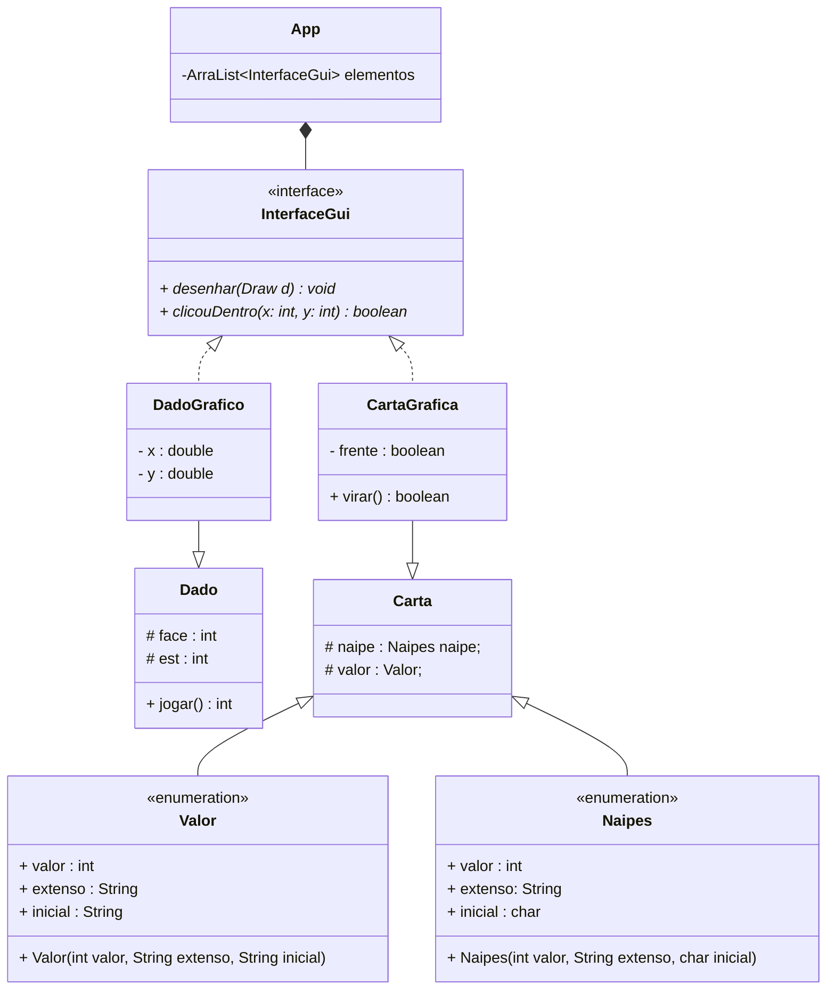

# Diagrama UML cartas e dados

```mermaid

classDiagram
    direction TB
    
    App *-- InterfaceGui
    InterfaceGui <|.. DadoGrafico
    InterfaceGui <|..CartaGrafica
    DadoGrafico --|> Dado
    CartaGrafica --|> Carta
    Carta <|-- Valor
    Carta <|-- Naipes
    
    
    class App {
        -ArraList~InterfaceGui~ elementos
    }
    
    class InterfaceGui {
        <<interface>>
        + desenhar(Draw d) void*
        + clicouDentro(x: int, y: int) boolean*
    }
    
    class Dado {
        # face : int
        # est : int
        
        + jogar() int
    }
    
    class DadoGrafico {
        - x : double
        - y : double
    }
    
    class Carta {
        # naipe : Naipes naipe;
        # valor : Valor;
    }
    
    class CartaGrafica {
        - frente : boolean
        + virar() boolean
    }
    
    class Valor {
        <<enumeration>>
        + valor : int
        + extenso : String
        + inicial : String

        + Valor(int valor, String extenso, String inicial)
    }

    class Naipes {
        <<enumeration>>
        + valor : int
        + extenso: String
        + inicial : char

        + Naipes(int valor, String extenso, char inicial)
    }
    
 

```