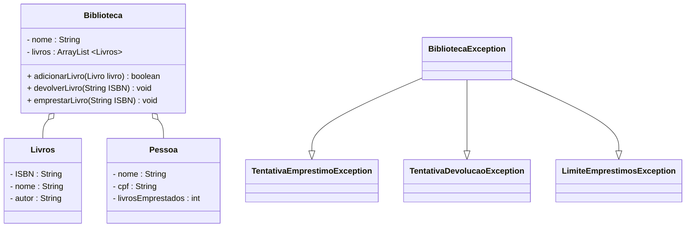

# UML de biblioteca para tratamento de excessões

```mermaid
classDiagram
    
    Biblioteca o-- Livros
    Biblioteca o-- Pessoa
    BibliotecaException --|> TentativaEmprestimoException
    BibliotecaException --|> TentativaDevolucaoException
    BibliotecaException --|> LimiteEmprestimosException
    
    class Biblioteca {
        - nome : String
        - livros : ArrayList ~Livros~
        + adicionarLivro (Livro livro) boolean
        + devolverLivro (String ISBN) void
        + emprestarLivro (String ISBN) void
    }
    
    class Livros {
        - ISBN : String
        - nome : String
        - autor : String
    }
    
    class Pessoa {
        - nome : String
        - cpf : String
        - livrosEmprestados : int
    }
    
    class BibliotecaException { }
    
    class TentativaEmprestimoException { }
    
    class TentativaDevolucaoException { }
    
    class LimiteEmprestimosException { }

```