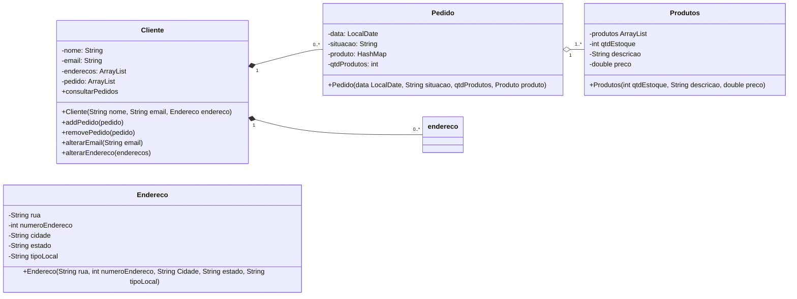

# Diagrama de classes UML

## Diagrama da classe comercioEletronico

```mermaid

classDiagram
    
    direction LR
    
    Cliente "1" *-- "0..*" Pedido
    Cliente "1" *-- "0..*" endereco
    Pedido "1" o-- "1..*" Produtos
    
    class Cliente {
        -nome: String
        -email: String
        -enderecos: ArrayList<Endereco>
        -pedido: ArrayList<Pedido>
        +Cliente(String nome, String email, Endereco endereco)
        +addPedido(pedido)
        +removePedido(pedido)
        +alterarEmail(String email)
        +alterarEndereco(enderecos)
        +consultarPedidos
    }

    class Endereco {
        -String rua
        -int numeroEndereco
        -String cidade
        -String estado
        -String tipoLocal
        +Endereco(String rua, int numeroEndereco, String Cidade, String estado, String tipoLocal)
    }
    
    class Pedido {
        -data: LocalDate
        -situacao: String
        -produto: HashMap<Produtos, qtdProdutos>
        -qtdProdutos: int
        +Pedido(data LocalDate, String situacao, qtdProdutos, Produto produto)
    }
    
    class Produtos {
        -produtos ArrayList<Produtos>
        -int qtdEstoque
        -String descricao
        -double preco
        +Produtos(int qtdEstoque, String descricao, double preco)
    }
    


    
```