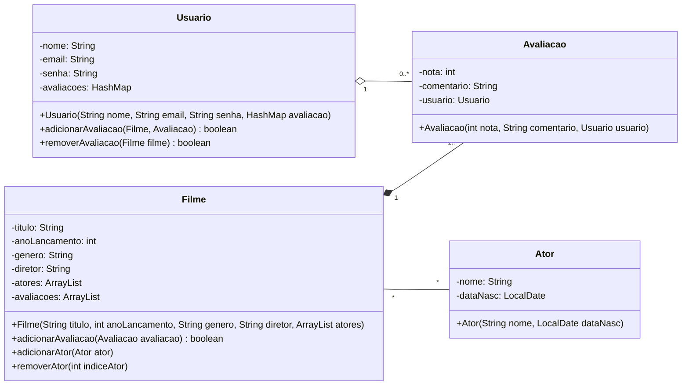

# Diagrama UML

## UML da classe avaliações de filmes

```mermaid
classDiagram
    
    direction LR
    
    Filme "1" *-- "1..*" Avaliacao
    Filme "*" -- "*" Ator
    Usuario "1" o-- "0..*" Avaliacao
    
    class Filme {
        -titulo: String
        -anoLancamento: int
        -genero: String
        -diretor: String
        -atores: ArrayList<Ator>
        -avaliacoes: ArrayList<Avaliacao>
        +Filme(String titulo, int anoLancamento, String genero, String diretor, ArrayList<Ator> atores)
        +adicionarAvaliacao(Avaliacao avaliacao) boolean
        +adicionarAtor(Ator ator)
        +removerAtor(int indiceAtor)
    }
    
    class Ator {
        -nome: String
        -dataNasc: LocalDate
        +Ator(String nome, LocalDate dataNasc)
    }
    
    class Avaliacao {
        -nota: int
        -comentario: String
        -usuario: Usuario
        +Avaliacao(int nota, String comentario, Usuario usuario)
    }

    class Usuario {
        -nome: String
        -email: String
        -senha: String
        -avaliacoes: HashMap<Filme, Avaliacao>
        +Usuario(String nome, String email, String senha, HashMap<Filme, Avaliacao> avaliacao)
        +adicionarAvaliacao(Filme, Avaliacao) boolean
        +removerAvaliacao(Filme filme) boolean
    }

```