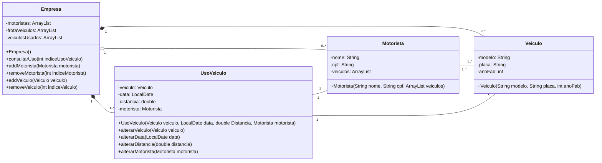

# Diagrama UML

## Diagrama da classe GestaoFrotas

```mermaid
classDiagram
    
    direction LR
    
    Empresa "1" *-- "0..*" Veiculo
    Empresa "1" o-- "0..*" Motorista
    Empresa "1" *-- "1..*" UsoVeiculo
    UsoVeiculo "1" -- "1" Motorista
    UsoVeiculo "1" -- "1" Veiculo
    Motorista "1..*" -- "1..*" Veiculo
    
    class Empresa {
        -motoristas: ArrayList<Motorista>
        -frotaVeiculos: ArrayList<Veiculo>
        -veiculosUsados: ArrayList<UsoVeiculo>
        +Empresa()
        +consultarUso(int indiceUsoVeiculo)
        +addMotorista(Motorista motorista)
        +removeMotorista(int indiceMotorista)
        +addVeiculo(Veiculo veiculo)
        +removeVeiculo(int indiceVeiculo)
    }
    
    class UsoVeiculo {
        -veiculo: Veiculo
        -data: LocalDate
        -distancia: double
        -motorista: Motorista
        +UsoVeiculo(Veiculo veiculo, LocalDate data, double Distancia, Motorista motorista)
        +alterarVeiculo(Veiculo veiculo)
        +alterarData(LocalDate data)
        +alterarDistancia(double distancia)
        +alterarMotorista(Motorista motorista)
    }
    
    class Veiculo{
        -modelo: String
        -placa: String
        -anoFab: int
        +Veiculo(String modelo, String placa, int anoFab)
    }
    
    class Motorista{
        -nome: String
        -cpf: String
        -veiculos: ArrayList<Veiculo>
        +Motorista(String nome, String cpf, ArrayList<Veiculo> veiculos)
    }
    
```