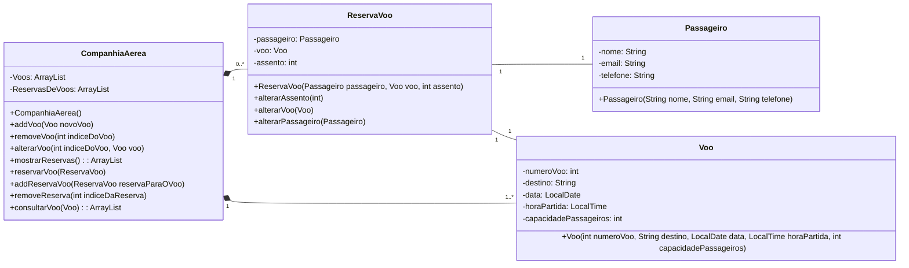

# Diagrama UML

## Diagrama da classe PassagensAereas

```mermaid
classDiagram
    
    direction LR

    CompanhiaAerea "1" *-- "0..*" ReservaVoo
    CompanhiaAerea "1" *-- "1..*" Voo
    ReservaVoo "1" -- "1" Passageiro
    ReservaVoo "1" -- "1" Voo
    
    
    class CompanhiaAerea{
        -Voos: ArrayList<Voo>
        -ReservasDeVoos: ArrayList<ReservaVoo>
        +CompanhiaAerea()
        +addVoo(Voo novoVoo)
        +removeVoo(int indiceDoVoo)
        +alterarVoo(int indiceDoVoo, Voo voo)
        +mostrarReservas(): ArrayList<ReservaVoo>
        +reservarVoo(ReservaVoo)
        +addReservaVoo(ReservaVoo reservaParaOVoo)
        +removeReserva(int indiceDaReserva)
        +consultarVoo(Voo): ArrayList<Voo>
    }

    class ReservaVoo {
        -passageiro: Passageiro
        -voo: Voo
        -assento: int
        +ReservaVoo(Passageiro passageiro, Voo voo, int assento)
        +alterarAssento(int)
        +alterarVoo(Voo)
        +alterarPassageiro(Passageiro)
    }
    
    class Voo {
        -numeroVoo: int
        -destino: String
        -data: LocalDate
        -horaPartida: LocalTime
        -capacidadePassageiros: int
        +Voo(int numeroVoo, String destino, LocalDate data, LocalTime horaPartida, int capacidadePassageiros)
    }
    
    class Passageiro {
        -nome: String
        -email: String
        -telefone: String
        +Passageiro(String nome, String email, String telefone)
    }
    
```