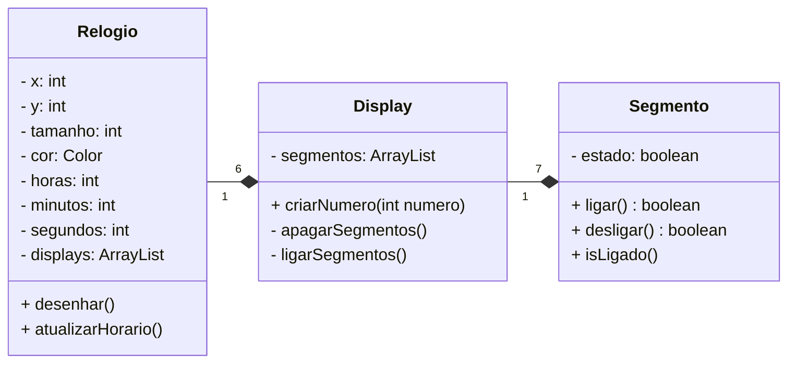

# UML do Relógio Digital com display de 7 segmentos

```mermaid
classDiagram
    
    direction LR
    
    Relogio "1" --* "6" Display
    Display "1" --* "7" Segmento
    
    class Relogio {
        - x: int
        - y: int
        - tamanho: int
        - cor: Color
        - horas: int
        - minutos: int
        - segundos: int
        - displays: ArrayList<Display>
        + desenhar()
        + atualizarHorario()
    }
    
    class Display {
        - segmentos: ArrayList<Segmento>
        + criarNumero(int numero)
        - apagarSegmentos()
        - ligarSegmentos()
    }
    
    class Segmento {
        - estado: boolean
        + ligar() boolean
        + desligar() boolean
        + isLigado()
    }

```