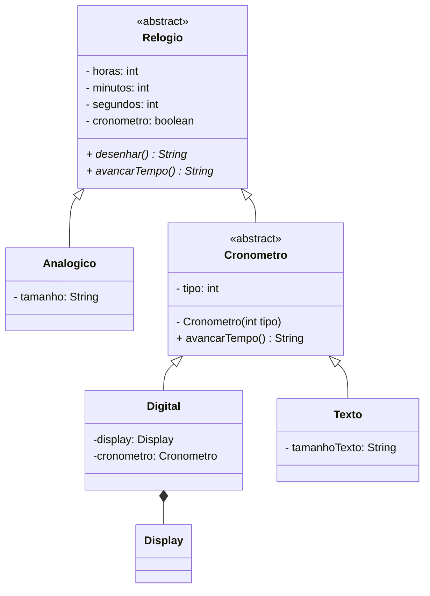

# UML para fazer o Lab 6 sobre relógios

```mermaid
classDiagram
    
    Relogio <|-- Analogico
    Relogio <|-- Cronometro
    Cronometro <|-- Digital
    Cronometro <|-- Texto
    Digital *-- Display
    
    class Relogio {
        <<abstract>>
        - horas: int
        - minutos: int
        - segundos: int
        - cronometro: boolean
        + desenhar() String*
        + avancarTempo() String*
    }
    
    class Analogico {
      - tamanho: String  
    }

    class Cronometro {
        <<abstract>>
        - tipo: int
        - Cronometro (int tipo)
        + avancarTempo() String
    }

    class Digital {
        -display: Display
        -cronometro: Cronometro
    }
    
    class Texto {
        - tamanhoTexto: String
    }
    
    class Display {
        
    }
```